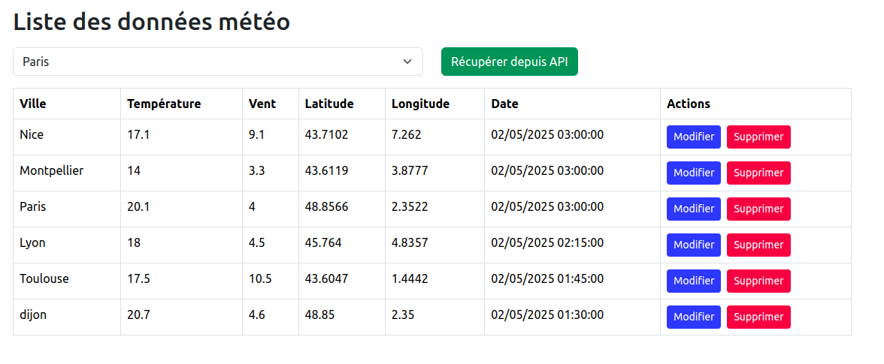
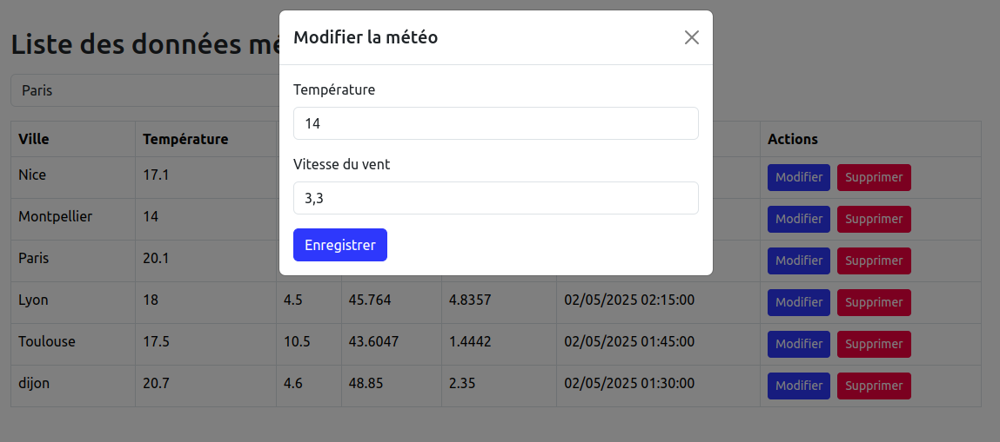
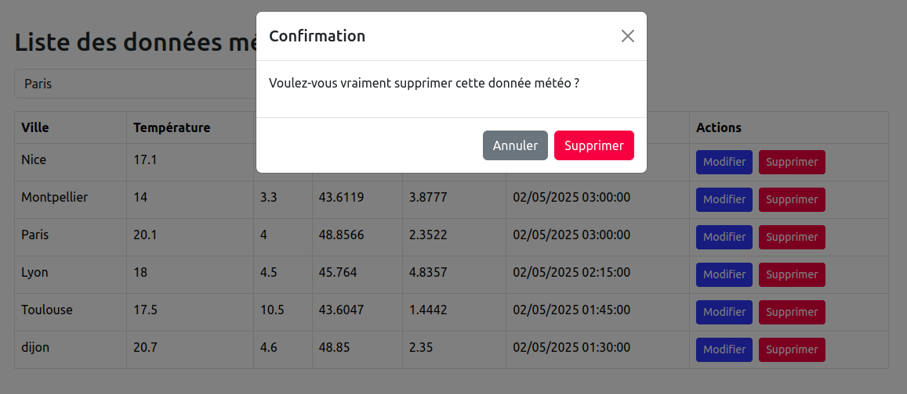

# Weather App

Cette application permet d'afficher, récupérer et gérer des données météo via l'API [Open-Meteo](https://open-meteo.com/).

---

## Aperçu







---

## Technologies utilisées

### Front-end

- Vue.js
- Axios
- Bootstrap

### Back-end

- Symfony(PHP)
- API Platform (REST API)
- Doctrine (base de données MySQL)
- NelmioCorsBundle

---

## Fonctionnalités

- Affichage des données météo (ville, température, vent, date…)
- Récupération des données depuis l’API Open-Meteo
- Modification des données via une modale
- Suppression avec confirmation
- Tests unitaires côté back

---

## Installation

### 1. Cloner le projet :

```bash
git clone https://github.com/RhofirAbdelali/weather-app.git
cd weather-app
```

### 2. Lancer le back-end

```bash
cd weather-api
composer install
php bin/console doctrine:database:create
php bin/console doctrine:migrations:migrate
symfony server:start
```

### 3. Lancer le front-end

```bash
cd weather-front
npm install
npm run dev
```

### 4. Lancer les tests unitaires

```bash
cd weather-api
php bin/phpunit
```
